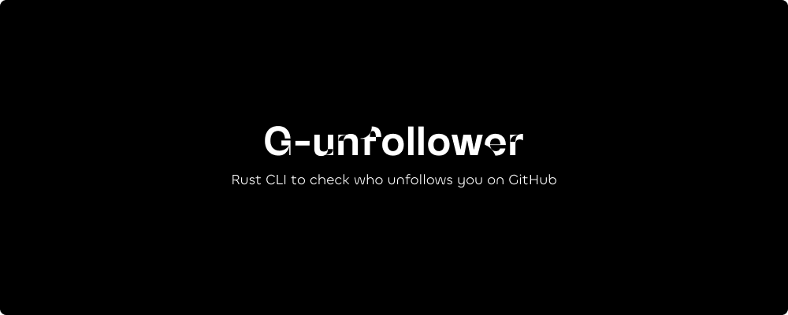
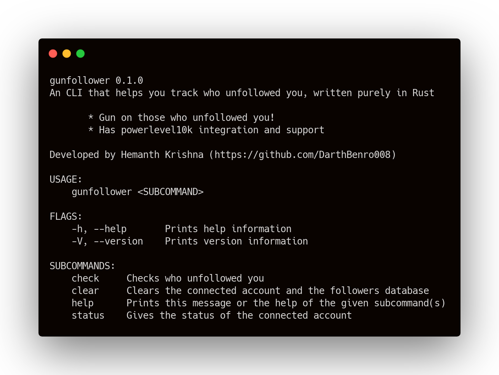
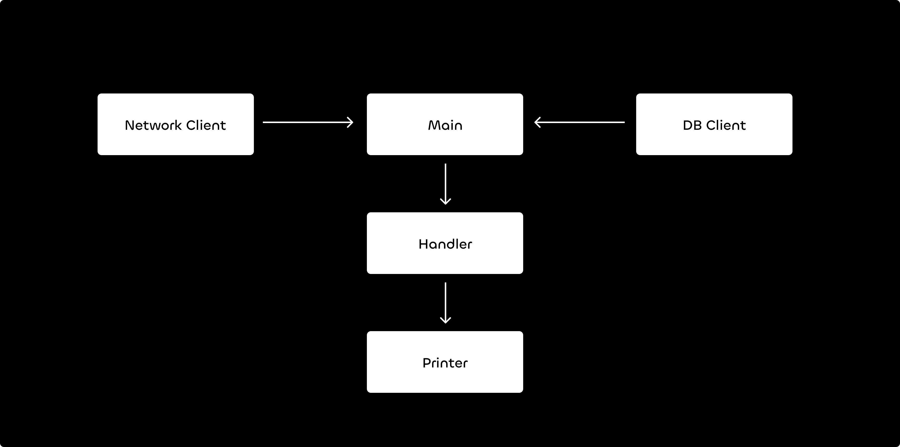

[](https://github.com/DarthBenro008/gunfollower/blob/master/LICENSE)
[](https://github.com/DarthBenro008/gunfollower/issues/new/choose)

> A CLI written in rust to check who follows and unfollows you on GitHub

# G-unfollower

A simple CLI that tell watches and let's you know if anyone has followed or unfollowed you recently with some cool caching mechanism.



## Installation

### Using Cargo

You can install gunfollower from Cargo

```bash
cargo install gunfollower
```

### Manual Installation

You can also download the binary and install it manually.

- Go to [releases page](https://github.com/DarthBenro008/gunfollower/releases) and grab the latest release of rChore.
- Download the latest release of rChore specific to your OS.
- If you are on Linux/MacOS, make sure you move the binary to somewhere in your `$PATH` (e.g. `/usr/local/bin`).

## Architecture




## 🤝 Contributions

- Feel Free to Open a PR/Issue for any feature or bug(s).
- Make sure you follow the [community guidelines](https://docs.github.com/en/github/site-policy/github-community-guidelines).
- Feel free to open an issue to ask a question/discuss anything about G-unfollower.
- Have a feature request? Open an Issue!

## ⚖ License

Copyright 2021 Hemanth Krishna

Licensed under MIT License : https://opensource.org/licenses/MIT

<p align="center">Made with ❤ and a single cup of coffee</p>